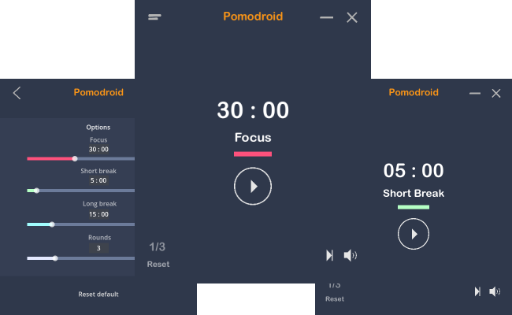

# Pomodroid

Pomodroid is a user-friendly and customizable Pomodoro timer. This app made with the [Godot engine 4.1](https://godotengine.org/). Its goal is to offer an aesthetically pleasing and dependable method for monitoring productivity through the Pomodoro Technique

Pomodroid timer appearance.

---

## Summary
The Pomodroid Timer app is a productivity application based on the Pomodoro Technique, designed to help users manage their time effectively and enhance their focus and productivity. Developed using the Godot Engine 4.1, this app provides a user-friendly interface and a range of features to assist users in implementing the Pomodoro Technique.

## Features
- Personalize the duration and numbers of rounds
- Sound notifications for timers
- Logging timer actions

## Install
Download the latest version from the [releases](https://github.com/rekvizitt/pomodroid-Godot-4.1/releases) page.
Pomodroid is available for Windows (as yet)

## License

MIT &copy; [rekvizitt](https://github.com/rekvizitt)
